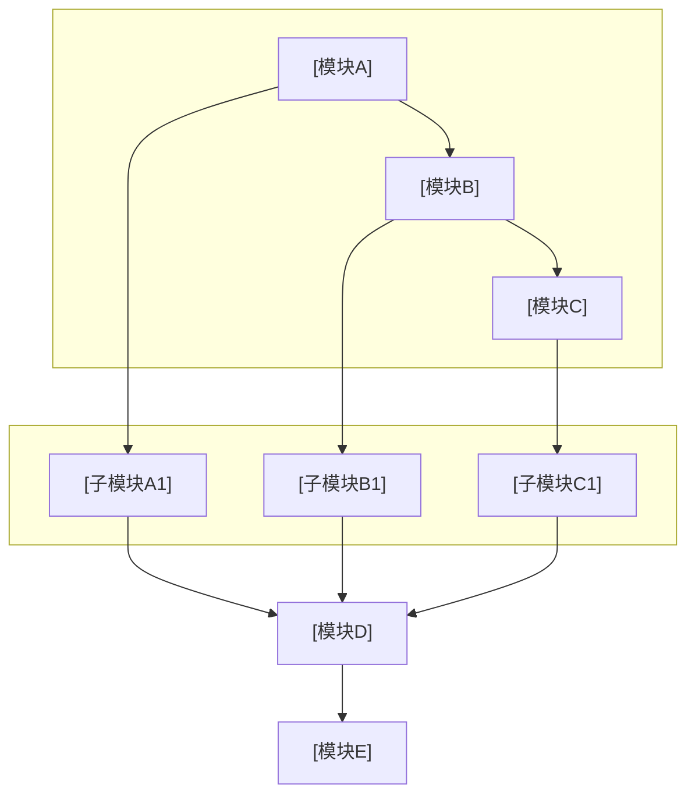

# 专利交底书模版参考（脱敏版）

本文档为技术交底书格式与章节要点参考，内容已脱敏，适用于多领域专利撰写。由 `disclosure_builder.md` 引用。

---

## 发明名称规范

根据《专利审查指南2023》：

| 要求 | 说明 |
|------|------|
| 字数 | 一般 ≤ 25 字，必要时 ≤ 60 字 |
| 术语 | 技术领域通用技术术语；不得使用非技术术语 |
| 内容 | 清楚反映主题和类型（产品/方法） |
| 禁止 | 人名、地名、商标、型号、商业宣传语 |

**推荐格式**：
- 方法类：`一种[技术领域]的[核心功能]方法`
- 系统类：`一种[技术领域]的[核心功能]系统`
- 方法+系统：`一种[核心功能]方法及系统`
- 产品+制造：`一种[产品]及其[制造/控制]方法`

**示例对照**：
- ❌ 「一种基于深度学习的牛逼图像识别方法」（宣传语）
- ❌ 「张三式自动驾驶系统」（人名）
- ✅ 「一种基于多尺度特征融合的图像目标检测方法」
- ✅ 「一种航天器相对导航博弈控制方法及系统」

---

## 文档头部

```markdown
# 技术交底书

**案件名称**：[待填写]一种XXX方法及系统

**技术联系人**：
- 姓名：[待填写]
- 电话：[待填写]
- 邮箱：[待填写]

**专利类型**：发明

---

## 注意事项

（1）交底书应使代理人能看懂，尤其是背景技术和详细技术方案，一定要写得全面、清楚、完整；
（2）技术的公开程度，应以本领域普通技术人员不需付出创造性劳动即可进行实施为准。
（3）在与代理人沟通时，对于代理人咨询的技术问题，应给予回答并认真讲解，并且按要求及时正确地补充相应技术材料。
```

在用户产出目录保存时，**`.md` / `.docx` 主文件名**应为 **`{案件名称规范化}_{YYYYMMDDHHmmss}`**（占位去掉、非法字符、过长截断及时间戳规则见 `disclosure_builder.md` **§7.3**，**凡交付均须时间戳**），避免与标题无关的固定名。

---

---

## 发明内容三步结构（第二章+第三章的核心逻辑）

根据《专利法实施细则》第二十条，发明内容部分需完成三步：

### 第一步：技术问题与技术效果（先写）
```
本发明/本申请实施例提供一种[技术方案名称]，能够解决[现有技术缺点]，实现[技术效果]。
```
- 用正面、**尽可能简洁**的语言表述
- 对应权利要求所提供的技术方案能解决的问题及效果

### 第二步：技术方案（次写）
```
本发明采用如下技术方案：
一种[名称]，包括：
[独立权利要求的技术方案——最小技术特征集的完整表述]
进一步地，[从属权利要求1的技术方案]
进一步地，[从属权利要求2的技术方案]
...
```
- 技术方案应与权利要求所限定的表述**相一致**（形式支持）
- 包含独立权利要求和从属权利要求的技术方案

### 第三步：有益效果（后写）
```
与现有技术相比，本发明具有以下有益效果：
1. 基于独立权利要求1的技术特征[特征描述]，实现了[效果]，带来了[具体收益]。
2. 基于从属权利要求X的技术特征[特征描述]，进一步实现了[效果]。
```
- 有益效果是由技术特征**直接带来**或**必然产生**的
- 针对每条独权撰写有益效果；可补充重要从权的效果
- 效果可体现在：精度/效率提高、能耗/工序节省、操作简便、环境污染治理等

---

## 具体实施方式的两种撰写范例

### 范例A：产品结构类

```
（1）重申技术背景与技术问题
[简要回顾现有技术的缺陷，引出本发明要解决的问题]

（2）独立权利要求方案总体说明
本发明提供的一种[名称]，包括[核心组成部分列举]。其工作原理为：[简述]。
与现有技术相比，本方案通过[核心区别特征]，解决了[技术问题]。

（3）结合附图的独权详细说明
如图1所示，本发明的[系统/装置]由[模块A]、[模块B]、[模块C]组成。
其中，[模块A]位于[位置]，与[模块B]通过[连接关系]相连……
[模块A]的作用是[功能说明]，其[具体结构/组成]……
[模块B]的作用是[功能说明]，其接收来自[模块A]的[数据/信号]，进行[处理]后输出至[模块C]……

在本实施例中，[具体参数/配置示例1]。
在另一实施例中，[具体参数/配置示例2——体现保护范围的宽度]。

（4）从属权利要求方案详细说明
[权2]：进一步地，[模块A]还包括[子模块A1]，用于[功能]。
其技术效果为：[从权2对应的效果]。
如图2所示，[子模块A1]的具体结构为……

[权3]：进一步地，[模块B]采用[特定方式]实现[功能]。
其技术效果为：[从权3对应的效果]。
具体地，[详细说明实现方式，可含多个实施例]……
```

### 范例B：方法类

```
（1）重申技术背景与技术问题
[与产品类相同]

（2）独立权利要求方案总体说明
本发明提供的一种[方法名称]，包括以下步骤：
步骤S1：[步骤名]——[简要说明]
步骤S2：[步骤名]——[简要说明]
步骤S3：[步骤名]——[简要说明]
通过上述步骤，本方法实现了[核心效果]。

（3）结合流程图的分步骤详细说明
如图1所示，本方法的具体流程如下：

步骤S1：[详细说明]
该步骤的目的是[作用说明]。具体地，[实现方式]。
在本实施例中，[参数/配置示例1]。
在另一实施例中，[参数/配置示例2]。
[若此步骤包含从属权利要求的技术特征，在此展开说明]

步骤S2：[详细说明]
该步骤接收步骤S1的[输出]作为输入。
[同上结构：目的→实现方式→参数示例→从权展开]

步骤S3：[详细说明]
[同上]

（4）其他方法独立权利要求（如有）
本发明还提供一种应用于[另一系统]的[方法名称]，包括：
[另一组方法权利要求的步骤展开]
```

---

## 一、技术背景与现有技术

### 1.1 现有技术

- 检索渠道、链接格式与禁止事项以 Step 5 **`prior_art_search.md`** 为准（不在此重复）。
- 按**技术方向**分类列举（如：单标签方法、多标签方法、聚类策略等）
- 每条现有技术需包含：专利号 / 文献标识、申请方（或来源机构）、技术方案、应用场景、**局限性**、**公开源 URL（必填）**
  - **国知局 `abstract`**：若 Step 5 JSON 含 **`abstract`**，该条「技术方案」等叙述**必须先充分理解摘要后**再概括（见 **`prior_art_search.md`**）；交底书正文勿大段粘贴官方摘要全文。
  - **URL 要求**：与 `prior_art_search.md` 一致——每条**至少一个**可公开访问链接，**写入前验证**有效且与著录项一致；**禁止虚构链接**。
  - **正文呈现建议**：在每条方向下可用「**来源链接**：…」单独一行，或表格增列「链接」。
- 结尾总结：检索总结、**本发明与现有技术的本质区别**

### 1.2 现有技术存在的缺点

- 分点列举，与 1.1 的局限性呼应
- 突出**核心缺陷**：现有技术无法解决的问题

---

## 二、本发明所要解决的技术问题

- 对应一中的缺点，逐条说明本发明的解决思路
- 简明扼要，为第三章详细方案做铺垫

---

## 三、技术方案详细阐述

### 3.1 背景

- 应用场景的通用描述（脱敏：用分类A/B/C、场景X等）
- 本发明针对的问题与核心创新点概述
- 若有人工环节，说明前提条件（如：样本需具有可区分显著特征）

### 3.2 系统框图

- 使用 **fenced mermaid**（推荐 `flowchart TB` / `LR` + `subgraph` 分层）；模块名抽象通用，避免业务术语
- 定稿交付前经 **`tools/mermaid_render.py`** 转为 PNG 并**默认**生成 Word；**不需要**再附 ASCII 文字框图（Word 中以图为准）
- 布局宜层次清晰；复杂时可拆多张 mermaid 图

**mermaid 系统框图模版**（替换标题与模块名、连线；与 3.4 相同为 `` ```mermaid`` 围栏）：



### 3.3 模块功能说明

**重点**：各模块的**作用**和**模块间关联关系**，专利不强调输入输出。

- 作用：该模块在整体方案中的角色
- 关联关系：上下游依赖、数据流/控制流、闭环关系

### 3.4 系统流程说明

#### 流程图

- 使用 **fenced mermaid** 代码块；**不要** ASCII 文字/箭头流程图。
- 定稿交付前用仓库 **`tools/mermaid_render.py`**（本地 `mmdc`）转为 PNG 并**默认**生成 Word；失败时按终端提示用 **`md_to_docx.py`** 手动转换。

#### 流程说明

- 用文字简要说明各步骤或与图中节点的对应关系（**不替代**流程图图示）
- 核心创新点可单独设子节（如 3.4.1）

### 3.5 关键技术参数

- 置信度/阈值类：含义、取值范围
- 算法参数：公式、约束条件
- 确保与正文公式、实施例数值一致

---

## 四、与现有技术相比的优点

- 先概括性观点，再分点详述
- 与第二章解决的问题、第五章保护点呼应
- 技术细节以第三章为准，本章以论点为主

---

## 五、技术关键点和欲保护点

- 列出核心创新点，每点简明定义
- 详细技术方案引用第三章（如「具体实现见 3.4.1」）
- 避免与第三章重复大段技术细节

### 欲保护点的层次构造（按权利要求7步法 步骤五/六）

**保护点应按以下层次布置**（详见 `claims_drafting.md`）：

```
保护点 1（独立权利要求——核心方案）：
  一种[名称]，包括[最小技术特征集构成的完整方案]。
  
  保护点 2（从属——关键创新点A的具体实现）：
    根据保护点1所述的[名称]，其中[关键创新点A的进一步限定]。
    
  保护点 3（从属——关键创新点A的替代方案）：
    根据保护点1所述的[名称]，其中[关键创新点A的替代实现方式]。
    
  保护点 4（从属——关键创新点B的具体实现）：
    根据保护点1所述的[名称]，其中[关键创新点B的进一步限定]。
    
  保护点 5（其他独立权利要求——产业链延伸）：
    一种[终端产品]，包括保护点1-4任一项所述的[核心部件]。
    
  保护点 6（其他独立权利要求——对应原则）：
    一种[执行方法的系统/装置]，用于实现保护点1所述的方法。
```

### 保护点层次示例

```
1. 一种基于EKF-SDRE的航天器相对导航博弈控制方法，其特征在于：
   通过扩展卡尔曼滤波器对追逐器与逃逸器的相对状态进行估计；
   基于状态估计结果，采用状态依赖Riccati方程方法计算追逐器和逃逸器的最优推力控制量；
   其中，EKF预测步骤与SDRE控制共享同一线性化点。

2. 根据权利要求1所述的方法，其特征在于：
   所述EKF采用仅测角测量模型（方位角+俯仰角），
   在测量更新步骤中对角度残差进行角度包裹处理。

3. 根据权利要求1所述的方法，其特征在于：
   所述SDRE控制中，对控制量施加幅值约束时，
   采用二次规划投影方法将无约束SDRE解投影到可行域。

4. 根据权利要求1所述的方法，其特征在于：
   当测量噪声低于预设阈值时，跳过EKF更新，
   直接使用动力学预测的相对状态计算SDRE控制。

5. 一种航天器相对导航博弈控制系统，其特征在于：
   包括用于执行权利要求1-4任一项所述方法的模块。
```

**交底书阶段**：保护点可以用自然语言分点表述，不要求严格的权利要求格式。但层次结构（独立→从属→其他组）应清晰可辨，便于代理人后续转换为正式权利要求书。参见 `claims_drafting.md` 完整7步法。

---

## 六、其它

### 实施例

- 应用场景（脱敏）
- 已知类别、无标签数据规模（脱敏）
- 系统流程简述
- **技术效果**：量化或定性说明
- **参数设置示例**：注明「不作为权利要求限制」

---

## 脱敏检查表

| 检查项 | 脱敏方式 |
|--------|----------|
| 业务/行业名称 | 抽象为通用描述 |
| 具体分类标签 | 分类A、分类B、分类C 等 |
| 具体数值 | 用「一定规模」「预设值」等 |
| 公司/产品名 | 删除或「某系统」 |

---

## 交付正文禁忌（勿写入交底书）

- **禁止**在全文任意位置（尤其**文末**）加入技能仓库、示例仓库、`patent-disclosure-skill`、`examples/` 路径、「教学/虚构示例」「不构成法律或技术承诺」等**元脚注**；交付物视为正式技术交底书文稿，**止于业务章节**。

## 公式与参数一致性检查

- 全文公式表述统一（如：置信度权重、密度调整系数）
- 阈值范围一致（如 0.5–1.5、0.8–1.2）
- 参数命名统一（避免同义不同名混用）
- 实施例数值与 3.5 节对应
